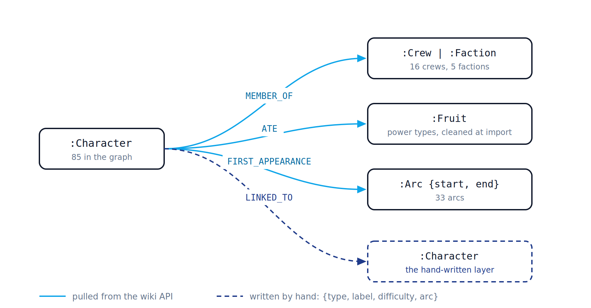
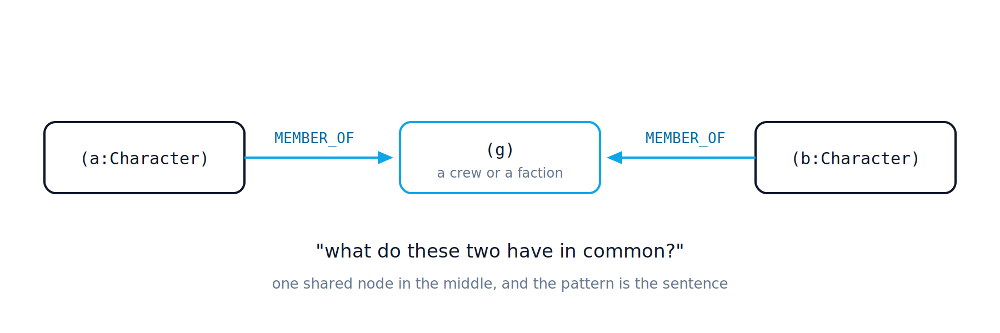
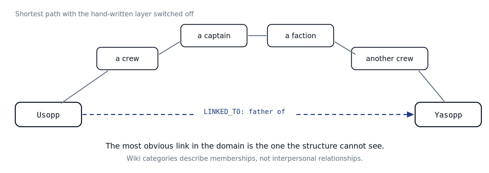
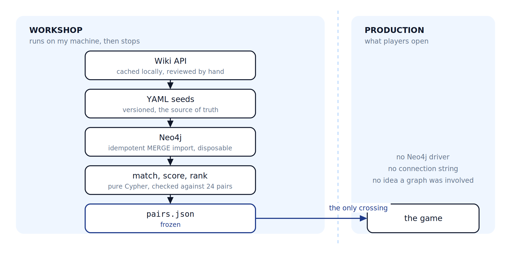

# Undercover OP

Un jeu de soirée façon « Undercover », joué sur l'univers *One Piece* — et le
prétexte d'un graphe de connaissances qui ne tourne **jamais** en production.

À chaque manche, la table reçoit un personnage. Sauf l'imposteur, qui en reçoit
un autre, lié au premier, sans savoir qu'il est l'imposteur. Indices à tour de
rôle, vote, révélation. L'hôte fixe à la création de la room un **calibrage** :
l'arc le plus avancé que la table accepte de voir, et rien au-delà ne sortira —
on ne divulgâche pas la série à celui qui n'en est qu'au quart.

La démarche est racontée en détail dans
[I Built a Knowledge Graph, But Kept It Out of Production](https://dev.to/rubharbe/i-built-a-knowledge-graph-but-kept-it-out-of-production-2bj1).
Ce README en donne la version courte, plus de quoi faire tourner le projet.

## L'objectif

Apprendre les graphes de connaissances et Cypher sérieusement, avec une
contrainte qui interdit de s'arrêter au tutoriel : **livrer quelque chose de
jouable**. Le graphe a bien résolu le problème. Il s'est aussi avéré qu'il
n'avait pas besoin de tourner pour que quiconque en profite.

## Le problème : « lié » n'est pas une colonne

Toute la mécanique du jeu tient dans un mot : les deux personnages doivent être
**liés**. Trop proches, personne ne démasque l'imposteur ; trop lointains, il se
trahit en une phrase. Il faut donc produire des paires connectées, et savoir à
quel point.

La difficulté n'est pas de stocker des paires, c'est de les **découvrir**. Et
« lié » ne se lit pas dans une colonne : c'est un chemin. Deux personnages sont
proches parce qu'ils partagent un équipage, une faction, un arc, un type de
pouvoir — ou par une relation directe, souvent plusieurs à la fois.

En relationnel, chaque forme de proximité devient sa table de jointure, et la
question « qui partage quoi » devient un empilement d'UNION qui grossit à chaque
nouveau type de lien. On finit par modéliser la question dans le schéma, quand on
voulait modéliser le domaine. C'est le symptôme classique qui justifie un graphe :
quand les jointures cessent d'être un détail d'implémentation pour devenir le
sujet.

## Le graphe



Tout le domaine tient en quatre lignes :

```cypher
(:Personnage)-[:MEMBRE_DE]->(:Equipage | :Faction)
(:Personnage)-[:MANGE]->(:Fruit)
(:Personnage)-[:PREMIERE_APPARITION]->(:Arc {debut, fin})
(:Personnage)-[:LIE_A {type, libelle, difficulte, arc}]->(:Personnage)
```

Les trois premières sont tirées de l'API du wiki. La quatrième est écrite à la
main : c'est la couche humaine, et elle est le cœur du sujet.

*(Les schémas viennent de l'article et portent des libellés anglais ; le dépôt,
lui, est en français. Ils reflètent aussi un état antérieur — 85 personnages et
24 paires, contre 89 et 38 aujourd'hui.)*

### Le motif du crochet



Presque toute la logique métier dérive d'une seule forme :

```cypher
(a:Personnage)-[:MEMBRE_DE]->(g)<-[:MEMBRE_DE]-(b:Personnage)
```

Deux personnages, un nœud partagé au milieu. C'est la question « qu'est-ce que
ces deux-là ont en commun » écrite littéralement. Le Cypher se lit à voix haute :
si la phrase ne se dit pas en français simple, c'est qu'on ne sait pas encore ce
qu'on cherche.

### La notoriété, mesurée plutôt que décrétée

La décision de modélisation qui a le plus rapporté : faire porter la notoriété
d'un personnage par son **degré** dans le graphe.

```cypher
size([(p)-[r]-() | r])
```

Plus il est connecté, plus il est central dans l'histoire, plus les joueurs le
connaissent. Conséquence : la notoriété n'est **jamais saisie à la main**. Elle
ne peut donc pas être mal jugée, et elle se met à jour toute seule quand on
ajoute des données. Une propriété du domaine devenue une mesure au lieu d'une
appréciation.

### Là où le graphe a dit non



Mesure de la distance entre un personnage et son père, couche manuelle
désactivée : le chemin doit passer par un équipage, un capitaine, une faction,
un autre équipage. Père et fils — le lien le plus évident du domaine — plus
éloignés que deux inconnus qui partagent une catégorie.

Ce n'est pas un bug, c'est une mesure de ce que contient la source. Les
catégories du wiki décrivent des appartenances, pas des relations
interpersonnelles, et aucune requête ne fera surgir ce qui n'est pas dans les
données. D'où `LIE_A`, la couche humaine. **Le graphe donne la structure ; le
sens, il faut encore l'apporter.**

## La chaîne de fabrication



- **Extraction** — les faits viennent de l'API du wiki, mis en cache localement,
  puis relus à la main. La donnée arrive sale ; on nettoie à l'import, pas à la
  requête.
- **Seeds versionnés** — des YAML relus, qui sont la source de vérité. Le graphe
  n'en est qu'une projection.
- **Import idempotent** — un générateur émet du Cypher depuis les seeds, tout
  passe par `MERGE`. Le graphe est jetable : il se reconstruit de zéro en une
  commande, donc on peut le casser sans cérémonie.
- **Requêtes de proposition** — le crochet, avec un filtre et un tri.
- **Score** — trois signaux, tous structurels : l'écart de notoriété, le nombre
  de groupes partagés, la précocité du lien. La difficulté écrite à la main en
  est **volontairement exclue** : l'inclure aurait rendu la validation
  tautologique.
- **Validation contre un étalon** — 24 paires choisies à la main avant d'écrire
  la moindre requête. La règle, posée avant de voir le moindre résultat : si le
  classement contredit le jugement humain, on corrige les poids, jamais les 24
  paires.
- **Export figé** — la chaîne émet un JSON. Le travail du graphe s'arrête là.

Doctrine du projet, valable partout : **le LLM drapeaute, l'humain arbitre,
jamais l'inverse.**

## Pourquoi le graphe reste hors production

Le service de jeu lit un fichier figé, et rien d'autre. Pas de driver Neo4j, pas
de chaîne de connexion, aucune idée qu'un graphe ait été impliqué
([ADR-0001](./docs/adr/0001-fichier-de-paires-fige.md)). L'alternative évidente —
interroger le graphe à l'exécution pour tirer les paires en direct — a été
écartée pour trois raisons :

1. **Aucune dépendance à une base pendant la partie.** Si Neo4j tombe, le jeu
   tombe. Pour quelque chose qu'on ouvre un vendredi soir, le risque est absurde.
2. **Des résultats validés une fois, pas calculés sous pression.** Rien ne se
   décide pendant que six personnes attendent sur leur téléphone.
3. **Le fichier sert d'étalon.** « Le graphe retrouve-t-il mes paires choisies à
   la main ? » devient une question littérale sur un artefact littéral.

Le coût est réel et assumé : ajouter des paires impose une repasse complète de la
chaîne et un redéploiement.

## Cartographie

Contextes : [CONTEXT-MAP.md](./CONTEXT-MAP.md) — le [jeu](./server/CONTEXT.md) et
la [fabrication](./fabrication/CONTEXT.md), chacun avec son vocabulaire.
Décisions de fond : [docs/decisions.md](./docs/decisions.md) et
[docs/adr/](./docs/adr/).

## Lancer

Image unique, le serveur sert aussi le bundle du front :

```sh
docker build -t undercover-op .
docker run -p 8000:8000 -v undercover-donnees:/donnees undercover-op
```

Le volume sur `/donnees` est obligatoire : sans lui le serveur refuse de démarrer
plutôt que d'écrire des signaux condamnés.

En développement, les deux moitiés séparément :

```sh
cd server && pip install -e ".[dev]" && python -m jeu   # :8000
cd front  && npm install && npm run dev                 # Vite
```

Tests : `pytest` côté serveur, `npm test` côté front.

### Les portraits

Le dépôt ne contient **aucun portrait** : ce sont des captures d'anime sous
droits, qui ne peuvent pas être redistribuées (voir « Licences », section 3).
Sans eux le jeu tourne, les cadres affichent des silhouettes.

`docker build` les moissonne lui-même — une étape dédiée du `Dockerfile` interroge
le wiki et pose les images dans le bundle. Le build a donc besoin du réseau, et
prend deux ou trois minutes de plus la première fois. Deux couches de cache
limitent la casse ensuite : la moisson ne dépend que de `seeds/pages.txt`,
l'extraction du contrat. Ajouter des paires sans nouveau personnage ne refait pas
la moisson.

**L'image produite contient donc les portraits.** Elle se déploie sur une
instance privée ; elle ne se publie pas sur un registre ouvert.

En développement (`npm run dev`), le bundle n'est pas construit : il faut poser
les fichiers à la main, une fois pour toutes.

```sh
cd fabrication
python wiki_extract.py       # peuple cache/ depuis le One Piece Wiki
python portraits_extract.py  # -> front/public/personnages/<id>.webp
```

Le résultat reste local : `front/public/personnages/` est ignoré par git, et doit
le rester.

La chaîne de fabrication (graphe Neo4j, génération des paires) ne tourne jamais
en production — voir [fabrication/CONTEXT.md](./fabrication/CONTEXT.md).

## Licences

Trois matières, trois régimes — le dépôt n'est pas sous licence unique.

**Le code** — MIT, voir [LICENSE](./LICENSE).

**Les données** (`fabrication/seeds/`, `fabrication/paires.json`) — dérivées du
[One Piece Wiki](https://onepiece.fandom.com) (Fandom), sous licence
[CC BY-SA 3.0](https://creativecommons.org/licenses/by-sa/3.0/), extraites et
remaniées pour ce projet. Le partage à l'identique se transmet : qui reprend les
paires hérite de la licence, MIT ne s'y applique pas.

**Les portraits** — captures d'anime appartenant à Shueisha, Toei Animation et
Eiichiro Oda. Le wiki les héberge au titre d'un *fair use* documentaire qui ne le
suit pas ailleurs, et le droit français ne connaît pas cette exception. Ils ne
sont donc **pas versionnés** ici : chaque instance les moissonne à la
construction, pour son propre usage, et l'image obtenue ne se publie pas sur un
registre ouvert.

Le raisonnement complet et les options écartées : [docs/licences.md](./docs/licences.md).

---

Jeu de fan non officiel, sans lien avec Eiichiro Oda, Shueisha, Toei Animation ou
leurs ayants droit. *One Piece* et ses personnages leur appartiennent.
